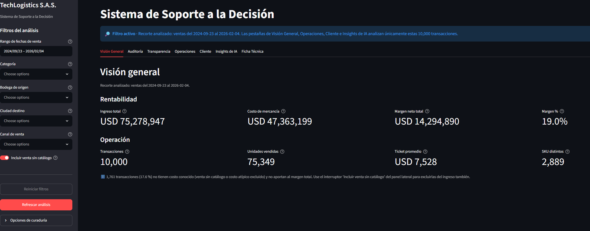
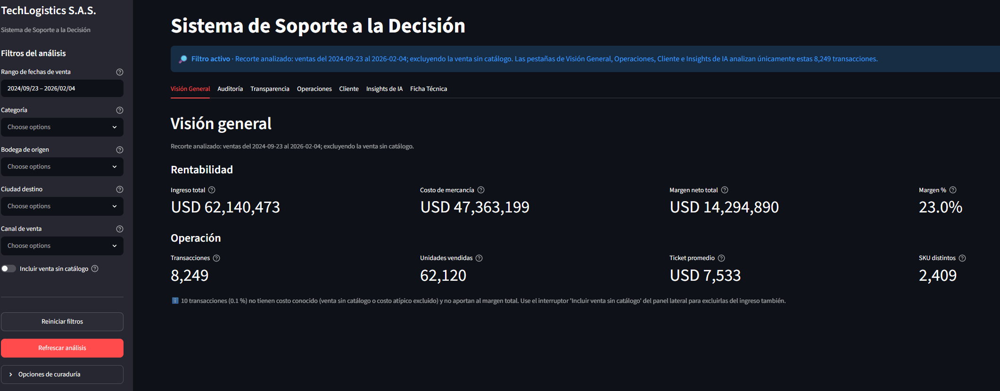
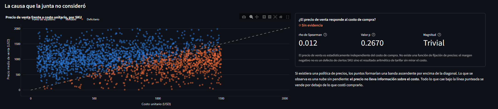
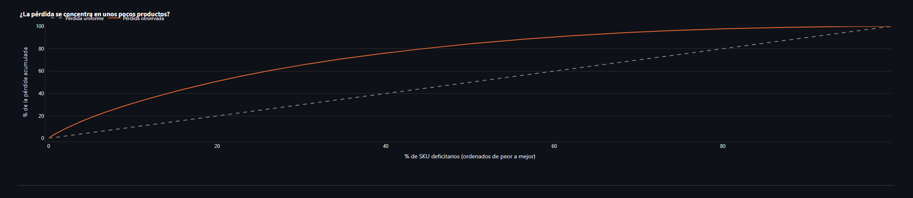
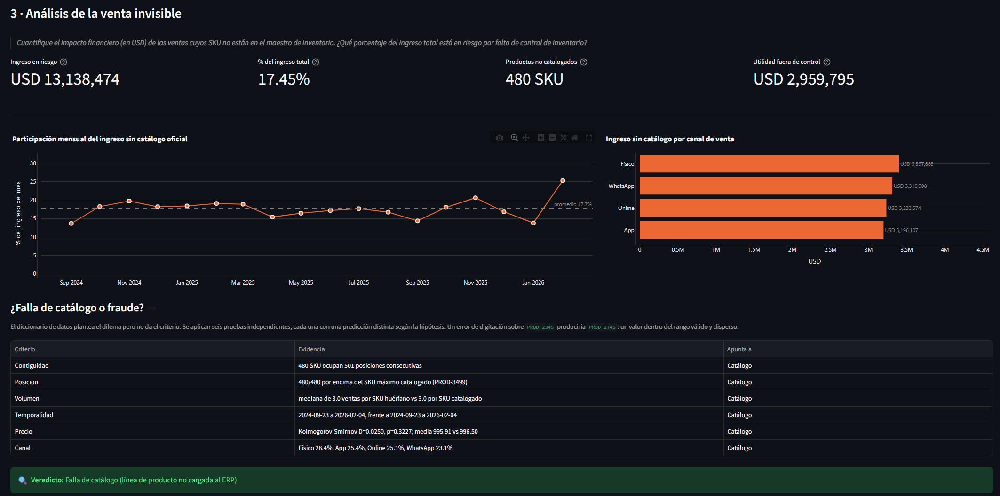
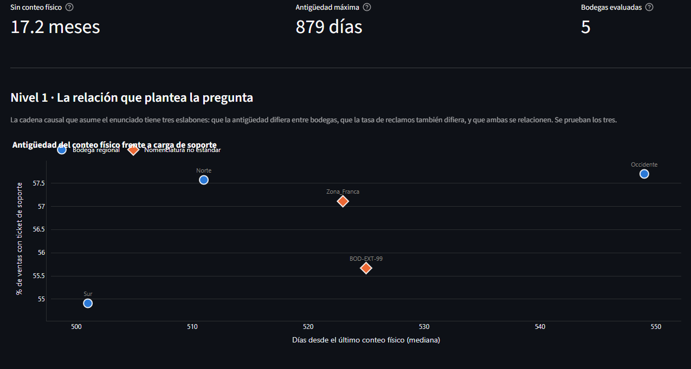
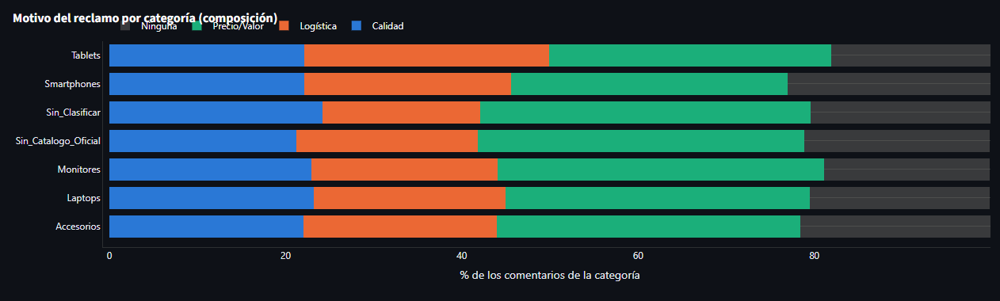

# Informe de Hallazgos — TechLogistics S.A.S.

---

## 1. Narrativa de negocio

### ¿Por qué la empresa está perdiendo dinero?

La junta directiva sospechaba que la caída de rentabilidad se debía a la
demanda. Los datos dicen otra cosa: **TechLogistics no tiene un problema de
demanda, tiene un problema de invisibilidad operativa** repartido en tres
frentes que no se hablan entre sí (precios, inventario y logística) y que
hasta ahora nadie había medido juntos.

1. **No existe una política de precios.** El precio de venta se fija con
   independencia estadística del costo de compra (correlación de Spearman
   ρ ≈ 0,012, p = 0,27, sin relación detectable). Eso significa que el
   margen negativo de 878 SKU (USD 7.663.968 acumulados) no es un conjunto de
   productos mal tarifados que se puedan corregir individualmente: es la
   consecuencia aritmética de un proceso de pricing que no mira el costo. La
   pérdida está **esparcida, no concentrada**, ni el top 50 de peores SKU
   explica el 40 % del daño, así que no hay una lista corta de correcciones
   que resuelva el problema.
2. **Casi 1 de cada 5 dólares de ingreso es invisible para el sistema de
   inventario.** 1.751 transacciones (17,51 %) corresponden a 480 SKU que
   se venden pero no existen en el maestro del ERP: USD 13.138.474 (17,45 %
   del ingreso total) sin costo conocido y por tanto sin margen auditable.
   Seis criterios estadísticos independientes (contigüidad, posición sobre
   el máximo catalogado, volumen de venta, temporalidad, precio y canal)
   coinciden en que es una **falla de catálogo**, o sea una línea de producto que
   nunca se cargó al ERP.
3. **Las bodegas operan a ciegas.** La mediana de tiempo sin un conteo
   físico de inventario es de **521 días (17,1 meses)**, más de un año y
   medio decidiendo reposición sobre stock no verificado. La tasa
   de reclamos todavía no difiere entre bodegas, lo que no es evidencia de
   que no haya riesgo: es evidencia de que el descuadre todavía no ha
   salido a la luz.
4. **La falla logística es sistémica, no de un operador puntual.** El 60,2 %
   de los envíos con estado registrado terminan con un estado de
   retrasado, perdido o devuelto. Ninguna de las 10 combinaciones de
   ciudad/bodega evaluadas sobrevive a la corrección de Bonferroni: no hay
   una ciudad ni una bodega culpable que señalar, el problema está distribuido
   en toda la red.
5. **El cliente ya está diciendo cuál es la causa, la cual es precio, no
   calidad.** El motivo de reclamo dominante es *Precio/Valor* (43,7 % de
   las quejas con causa identificada, por encima de Calidad con 28,4 % y
   Logística con 27,9 %). Ni la calificación de producto ni el nivel de
   stock se diferencian entre categorías, así que la "paradoja de fidelidad" que
   plantea el enunciado no existe como tal: el problema no es una categoría
   con mala calidad y mucho inventario, es un problema transversal de precio
   percibido.

**Síntesis:** la rentabilidad no se está erosionando por un evento aislado
corregible con una lista de SKU o una plaza logística. Se erosiona porque
tres sistemas (precios, catálogo e inventario físico) operan sin
retroalimentarse entre sí, y ese vacío se financia con margen.

### Cómo lo demuestran los datos

| Hallazgo | Prueba estadística | Resultado | Lectura |
|---|---|---|---|
| Precio no depende del costo | Correlación de Spearman | ρ ≈ 0,012, p = 0,27 → **Sin evidencia** de relación | No hay función de pricing |
| Canal Online no es el culpable | Chi-cuadrado + V de Cramér | p = 0,007 pero V = 0,038 → **Significativo pero irrelevante** | El canal cruza el umbral estadístico por el tamaño de la muestra. |
| Pérdida no es "producto gancho" | Correlación volumen vs. margen unitario | p = 0,80 → **Sin evidencia** | El SKU de alto volumen no tiene peor margen unitario |
| Ninguna plaza logística concentra el problema | 10 correlaciones ciudad/bodega + Bonferroni | 0 de 10 sobreviven | El cuello de botella es de todo el proceso, no de un nodo |
| Venta fantasma es falla de catálogo | 6 criterios independientes (contigüidad, posición, volumen, tiempo, precio [Kolmogorov-Smirnov], canal) | 5-6 de 6 apuntan a "catálogo" | No es fraude ni error de digitación |
| La categoría no explica la insatisfacción | Kruskal-Wallis (rating y stock por categoría) | p = 0,97 y p = 0,12 → **Sin evidencia** en ambos | La causa es transversal, no de una categoría específica |

---

## 2. Pruebas visuales

### Captura 1 — Visión General, con y sin venta sin catálogo

---

### Captura 2 — Operaciones, Pregunta 1: costo vs. precio de venta

---

### Captura 3 — Operaciones, Pregunta 1: curva de Pareto de la pérdida

---

### Captura 4 — Operaciones, Pregunta 3: venta invisible

---

### Captura 5 — Cliente, Pregunta 5: antigüedad de conteo por bodega

---

### Captura 6 — Cliente, Pregunta 4: causa raíz del reclamo

---

## 3. Plan de acción

Tres recomendaciones tácticas, ordenadas para ejecutarse en secuencia: la de
menor complejidad primero, mientras se planifican las de mayor alcance.

### 1. Cerrar la brecha de catálogo — Complejidad: **Baja**

**Qué hacer:** cargar al maestro de inventario del ERP los 480 SKU
identificados como huérfanos, junto con su costo unitario real.

**Por qué es de baja complejidad:** no requiere rediseñar ningún proceso ni
sistema nuevo. Los seis criterios de diagnóstico ya identificaron
exactamente qué SKU faltan y confirmaron que es un problema de carga de
datos. Es una tarea de gobierno de datos maestros, ejecutable por el equipo 
de ERP en el corto plazo.

**Impacto esperado:** recupera trazabilidad de costo sobre **USD
13.138.474** (17,45 % del ingreso) y hace calculable el margen real de esa
porción de la operación, incluyendo si alguno de esos 480 SKU también está
vendiéndose con pérdida.

### 2. Piso de margen mínimo en la fijación de precios — Complejidad: **Media**

**Qué hacer:** establecer una regla de negocio que impida publicar un precio
de venta por debajo de un margen mínimo sobre el costo (por ejemplo, un
porcentaje piso por categoría), con un flujo de aprobación explícito para
las excepciones.

**Por qué es de complejidad media:** no exige infraestructura nueva, pero sí
modificar el proceso comercial de fijación de precios y coordinar con el
equipo comercial para definir los pisos por categoría y el flujo de
excepciones.

**Impacto esperado:** ataca la causa raíz de los **USD 7.663.968** en
pérdida acumulada (878 SKU) en la fuente, en vez de perseguir SKU por 
SKU.

### 3. Conteo periódico de inventario y trazabilidad de fallas logísticas — Complejidad: **Alta**

**Qué hacer:** implementar un programa recurrente de conteo físico por
bodega (por ejemplo trimestral) y un sistema de trazabilidad que registre 
en qué punto de la cadena (bodega, operador, transporte) se origina cada 
envío retrasado, perdido o devuelto.

**Por qué es de alta complejidad:** el riesgo de inventario y la falla
logística son **sistémicos**. La solución no puede ser puntual: exige 
coordinar las 5 bodegas y a los operadores logísticos, posiblemente invertir 
en herramientas de tracking, y sostener el proceso en el tiempo antes de ver 
resultado, ya que el 60,2 % de envíos retrasados, perdidos ni devueltos se
explica hoy por ninguna variable medida.

**Impacto esperado:** reduce el riesgo antes de que se materialice en
faltantes de stock o pérdidas y genera, por primera vez, los datos
necesarios para diagnosticar qué está causando el 60,2 % de envíos
retrasados, perdidos o devueltos, que con la información actual no se 
puede atribuir a ninguna ciudad ni bodega en particular.
